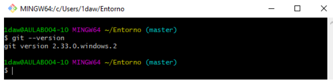

# ENTORNOS DE DESARROLLO #

### Unidad 1- Elementos de desarrollo de software ###
1. Desarrollo de software  
i. Modelo en cascada  
ii.Modelos evolutivos   

2. Metodologías ágiles

### Unidad 2- Instalación y uso de entornos de desarrollo ###

- IntelliJ IDEA 
- Eclipse 
- NetBeans 

### Unidad 3- Sistemas de control de versiones  ###

<pre> git -- version </pre>
